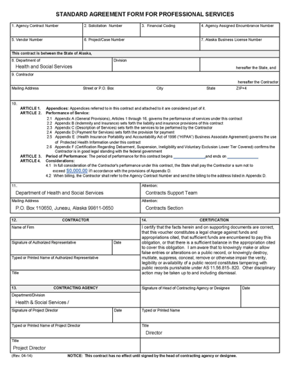

# State of Alaska Request for Proposals

**Alaska Asset Verification System (AVS)/Enhanced Verification System
(EVS)**

RFP 2000000034

Issued 1/23/2020

The Alaska Department of Health and Social Services, Division of Public
Assistance is soliciting proposals from qualified offeror's for a web
hosted subscription service to meet the requirements of Supplemental
Appropriations Act, 2008, Pub. L. No. 110-252; Section 1940 of the
Social Security Act, Alaska Statutes (AS) 47.05.105 and 7 CFR 272.16 for
asset, income, identity and new hire matches. The goals of this project
are to procure a subscription service, supplemented with regularly
scheduled bulk data matches, to verify applicants meet the eligibility
criteria for Public Assistance programs quickly and accurately.

------------------------------------------------------------------

## ISSUED BY:
 
Department of Health And Social Services 
Division of Public Assistance              

## PRIMARY CONTACT: 
 
Susan Jabal 
Procurement Officer 
Susan.Jabal@alaska.gov 
                                           

------------------------------------------------------------------

OFFERORS ARE NOT REQUIRED TO RETURN THIS FORM.

Important Notice: If you received this solicitation from
the State of Alaska's 'Online Public Notice' (OPN) web site, you must
register with the procurement officer listed in this document to
receive subsequent amendments.

## TABLE OF CONTENTS

### Section 1. INTRODUCTION AND INSTRUCTIONS
- [Sec. 1.01	Purpose of the RFP](#1.01)
- [Sec. 1.02	Budget](#1.02)
- [Sec. 1.03	Deadline for Receipt of Proposals](#1.03)
- [Sec. 1.04	Minimum Qualifications](#1.04)
- [Sec. 1.05	Required Review](#1.05)
- [Sec. 1.06	Questions Prior to Deadline for Receipt of Proposals](#1.06)
- [Sec. 1.07	Return Instructions](#1.07)
- [Sec. 1.08	Proposal Contents](#1.08)
- [Sec. 1.09	Assistance to Offerors with a Disability](#1.09)
- [Sec. 1.10	Amendments to Proposals](#1.10)
- [Sec. 1.11	Amendments to the RFP](#1.11)
- [Sec. 1.12	RFP Schedule](#1.12)
- [Sec. 1.13	Pre-Prososal Conference](#1.13)
- [Sec. 1.14	Alternate Proposals](#1.14)
- [Sec. 1.15	News Releases](#1.15)

### Section 2.	SCOPE & DELIVERABLES
- [Sec. 2.01	Background Information](#2.01)
- [Sec. 2.02	Contract Term and Work Schedule](#2.02)
- [Sec. 2.03	Scope of Work](#2.03)
- [Sec. 2.04	Deliverables](#2.04)
- [Sec. 2.05	Requirements](#2.05)

### Section 3. CONTRACT INFORMATION
- [Sec. 3.01	Contract Type](#3.01)
- [Sec. 3.02	Proposed Payment Procedures](#3.02)
- [Sec. 3.03	Contract Payment](#3.03)
- [Sec. 3.04	Location of Work](#3.04)
- [Sec. 3.05	Subcontractors](#3.05)
- [Sec. 3.06	Joint Ventures](#3.06)
- [Sec. 3.07	Right to Inspect Place of Business](#3.07)
- [Sec. 3.08	Contract Personnel](#3.08)
- [Sec. 3.09	Inspection & Modification - Reimbursement For Unacceptable Deliverables](#3.09)
- [Sec. 3.10	Contract Changes - Unanticipated Amendments](#3.10)
- [Sec. 3.11	Nondisclosure and Confidentiality](#3.11)
- [Sec. 3.12	Insurance Requirements](#3.12)
- [Sec. 3.13	Termination for Default](#3.13)

### Section 4.	PROPOSAL FORMAT AND CONTENT
- [Sec. 4.01	Proposal Format and Content](#4.01)
- [Sec. 4.02	Introduction ](#4.02)
- [Sec. 4.03	Technical Understanding and Approach](#4.03)
- [Sec. 4.04    Project Management Approach](#4.04)
- [Sec. 4.05	Staffing Plan](#4.05)
- [Sec. 4.06	Similar Experience and Qualifications](#4.06)
- [Sec. 4.07	Verbal Presentation](#4.07)
- [Sec. 4.08	Cost Proposal](#4.08)
- [Sec. 4.09	Evaluation Criteria](#4.09)

### Section 5.	EVALUATION CRITERIA AND CONTRACTOR SELECTION (TOTAL NUMBER OF POINTS USED TO SCORE THIS PROPOSAL IS 1000)

- [Sec. 5.01	Understanding of the Project (20%)](#5.01)
- [Sec. 5.02	Methodology Used for Project (5%) ](#5.02)
- [Sec. 5.03	Management Plan for the Project (5%)](#5.03)
- [Sec. 5.04	Experience and Qualifications (10%)](#5.04)
- [Sec. 5.05	Verbal Presentation (30%)](#5.05)
- [Sec. 5.06	Contract Cost (30%)](#5.06)

### Section 6.	GENERAL PROCESS INFORMATION
- [Sec. 6.01	Informal Briefing](#6.01)
- [Sec. 6.02	Alaska Business License and Other Required Licenses](#6.02)
- [Sec. 6.03	Site Inspection](#6.03)
- [Sec. 6.04	Clarification of Offers](#6.04)
- [Sec. 6.05	DIscussions With Offerors](#6.05)
- [Sec. 6.06	Evaluation of Proposals](#6.06)
- [Sec. 6.07	Contract Negotiation](#6.07)
- [Sec. 6.08	Failure to Negotiate](#6.08)
- [Sec. 6.09	Offeror Notification of Selection](#6.09)
- [Sec. 6.10	Protest](#6.10)
- [Sec. 6.11	Application of Preference](#6.11)
- [Sec. 6.12	Formula Used to Convert Cost to Points](#6.12)
- [Sec. 6.13	Examples: Converting Cost to Points](#6.13)

### Section 7. GENERAL LEGAL INFORMATION
- [Sec. 7.01	Standard Contract Provisions](#7.01)
- [Sec. 7.02	Proposal as a Part of the Contract](#7.02)
- [Sec. 7.03	Additional Terms and Conditions](#7.03)
- [Sec. 7.04	Human Trafficking](#7.04)
- [Sec. 7.05	Right of Rejection](#7.05)
- [Sec. 7.06	State Not Responsible For Preparation Costs](#7.06)
- [Sec. 7.07	Disclosure of Proposal Contents](#7.07)
- [Sec. 7.08	Assignment](#7.08)
- [Sec. 7.09	Disputes](#7.09)
- [Sec. 7.10	Severability](#7.10)
- [Sec. 7.11	Supplemental Terms and Conditions](#7.11)
- [Sec. 7.12	Federal Requirements](#7.12)
- [Sec. 7.13	Contract Invalidation](#7.13)
- [Sec. 7.14	Solicitation Advertising](#7.14)

### Section 8. Attachments
- [Sec. 8.01	Appendix 1 – Cost Proposal](#8.01)
- [Sec. 8.02	Appendix 2 - RFP Checklist](#8.02)
- [Sec. 8.03	Appendix 3 - Proposal Evaluation Checklist](#8.03)
- [Sec. 8.04	Appendix 4 - Federal Requirements](#8.04)
- [Sec. 8.05	Appendix 5 - Certificartion Regarding Debarment](#8.05)
- [Sec. 8.06	Appendix 6 - Template Standard Agreement Form](#8.06)

## SECTION 1. INTRODUCTION & INSTRUCTIONS

### SEC. 1.01 PURPOSE OF THE RFP

The Alaska Department of Health and Social Services, Division of Public Assistance is soliciting proposals from qualified offeror’s for a web hosted subscription service to  meet the requirements of Supplemental Appropriations Act, 2008, Pub. L. No. 110-252; Section 1940 of the Social Security Act, Alaska Statutes (AS) 47.05.105 and 7 CFR 272.16 for asset, income, identity and new hire matches. The goals of this project are to procure a subscription service, supplemented with regularly scheduled bulk data matches, to verify applicants and recipients of assistance meet the eligibility criteria for Public Assistance programs quickly and accurately. 

Alaska Statutes (AS) 47.05.105 requires the Department of Health and Social Services, Division of Public Assistance to establish an enhanced computerized income, asset and identity verification system for the purposes of verifying eligibility, eliminating duplication of public assistance payments, and deterring waste and fraud in public assistance programs administered by the department.

More information about what Alaska requires can be found in
 [SECTION 2](#2.01)

### SEC. 1.02 BUDGET

Department of Health and Social Services, Division of Public Assistance, estimates an initial budget of $1,447,600 dollars for 1 year for completion of this project. Year 1 costs include implementation activities. Upon completion of the initial term of the contract, the State may choose to exercise four (4) annual renewal options anticipated to be valued at $897,600 annually. If the full five (5) year term is executed the value is estimated to be $5,038,000. Payment for the contract is subject to funds already appropriated and identified.

### SEC. 1.03 DEADLINE FOR RECEIPT OF PROPOSALS

Proposals must be received no later than 2:00 pm prevailing Alaska Time on Friday, February 21, 2020.

### SEC. 1.04 MINIMUM QUALIFICATIONS 

In order for offers to be considered responsive offerors must meet these
minimum prior experience requirements:

-   The offeror must have three (3) years in the last five (5) of
    experience offering web based subscription services in
    asset/enhanced verification systems approved by the Centers for
    Medicare & Medicaid Services.

An offeror's failure to meet these minimum prior experience requirements may cause their proposal to be considered non-responsive and their proposal may be rejected.

Offerors must also complete the attachment ‘AVS Required Vendor Response - DHSS IT Requirements’, and return it as part of their proposal. A failure to complete and return this IT Reference will result in a proposal being deemed non-responsive.

In the body of their proposal, offerors must provide comprehensive narrative statements that illustrate their understanding of the technical requirements and must respond to all applicable sections, or respond why a section is not applicable. A failure to demonstrate how the solution being proposed addresses the Technical Requirements outlined may result in the proposal deemed non-responsive and rejected.

### SEC. 1.05 REQUIRED REVIEW

Offerors should carefully review this solicitation for defects and
questionable or objectionable material. Comments concerning defects and
objectionable material must be made in writing and received by the
procurement officer at least ten days before the deadline for receipt of
proposals. This will allow time for the issuance of any necessary
amendments. It will also help prevent the opening of a defective
solicitation and exposure of offeror\'s proposals upon which award could
not be made. Protests based on any omission or error, or on the content
of the solicitation, will be disallowed if these faults have not been
brought to the attention of the procurement officer, in writing, at
least ten days before the deadline for receipt of proposals.

### SEC. 1.06 QUESTIONS PRIOR TO DEADLINE FOR RECEIPT OF PROPOSALS

All questions must be in writing and directed to the procurement
officer. The interested party must confirm telephone conversations in
writing.

Two types of questions generally arise. One may be answered by directing
the questioner to a specific section of the RFP. These questions may be
answered over the telephone. Other questions may be more complex and may
require a written amendment to the RFP. The procurement officer will
make that decision.

Questions or comments regarding this RFP shall be submitted as [issues
within this RFP\'s GitHub
repository](https://github.com/AlaskaDHSS/RFP-AVS-EVS/) no later than 5:00 PM (Alaska Standard Time) on Monday, February 10, 2020, to allow the State sufficient time to respond. All questions and comments will be publicly available. Please subscribe to the repository if your firm would like updates about changes and comments. Questions or comments received after the required deadline may not be answered.

Questions may also be submitted in writing to the Procurement Officer,
who will post them as issues with the GitHub repository listed above.

PROCUREMENT OFFICER: **Susan Jabal** 

EMAIL **Susan.jabal@alaska.gov**

### SEC. 1.07 RETURN INSTRUCTIONS

**Email Submission**

The preferred method of response submission to this solicitation is via email, sent to the following address: 
	hss.procurement.proposal@alaska.gov 

The email submission must contain the RFP number in the subject line. In the body of the email, please indicate the Procurement Officer’s name, the Offeror’s name, the number of attachments, and the names of the attachments being submitted.

When submitting a proposal via email, the technical proposal and cost proposal must be saved as separate, clearly labeled PDF documents, such as “Vendor A – Technical Proposal.pdf” and “Vendor A – Cost Proposal.pdf” (Vendor A is the name of the offeror). The maximum size of a single email (including all text and attachments) that can be received by the State is 20mb (megabytes). If the email containing the proposal exceeds this size, the proposal must be sent in multiple emails that are each less than 20 megabytes; each email must complying with the requirements above. Please also include an indication of multiple email submissions (1 of 2, 2 of 2, etc).

It is the offeror’s responsibility to ensure that the Procurement Officer has received the proposal in full, prior to the deadline. The Procurement Officer will respond to the email to confirm receipt. If you do not receive a confirmation, it is your responsibility to contact the Procurement Officer to confirm. The State is not responsible for lost, unreadable, or corrupt emails, or missing attachments.

An offeror’s failure to submit its proposal prior to the deadline will cause the proposal to be disqualified. 
Late proposals or amendments will not be opened or accepted for evaluation.

**Paper Submission** 

If submitted a proposal by mail, Offerors must submit one hard copy of their proposal, to the procurement officer, in a sealed package. The cost proposal included with the package must be sealed separately from the rest of the proposal and must be clearly identified. 

The sealed proposal package(s) must be addressed as follows:

Department of Health and Social Services 
Division of Finance and Management Services 
Attention: Susan Jabal, Procurement Officer 
RFP Number: 200000034 
RFP Title: DPA AVS/EVS

If using *U.S. mail*, please use the following address:

PO BOX 11065 
JUNEAU, AK 99811-0650

If using a *delivery service*, please use the following address:

333 WILLOUGHBY AVE., ROOM 760 
JUNEAU, AK 99801

An offeror’s failure to submit its proposal prior to the deadline will cause the proposal to be disqualified. 
Late proposals or amendments will not be opened or accepted for evaluation. 

Faxed proposals will not be accepted. Oral proposals will not be accepted.

### SEC. 1.08 PROPOSAL CONTENTS

The following information must be included in all proposals:

#### (a) AUTHORIZED SIGNATURE

All proposals must be signed by an individual authorized to bind the
offeror to the provisions of the RFP. Proposals must remain open and
valid for at least 90-days from the date set as the deadline for receipt
of proposals.

#### (b) OFFEROR'S CERTIFICATION

By signature on the proposal, offerors certify that they comply with the
following:

a.  the laws of the State of Alaska;

b.  the applicable portion of the Federal Civil Rights Act of 1964;

c.  the Equal Employment Opportunity Act and the regulations issued
    thereunder by the federal government;

d.  the Americans with Disabilities Act of 1990 and the regulations
    issued thereunder by the federal government;

e.  all terms and conditions set out in this RFP;

f.  a condition that the proposal submitted was independently arrived
    at, without collusion, under penalty of perjury;

g.  that the offers will remain open and valid for at least 90 days; and

h.  that programs, services, and activities provided to the general
    public under the resulting contract conform with the Americans with
    Disabilities Act of 1990, and the regulations issued thereunder by
    the federal government.

If any offeror fails to comply with \[a\] through \[h\] of this
paragraph, the state reserves the right to disregard the proposal,
terminate the contract, or consider the contractor in default.

####  (c) VENDOR TAX ID

A valid Vendor Tax ID must be submitted to the issuing office with the proposal or within five days of the state's request.

####  (d) CONFLICT OF INTEREST

Each proposal shall include a statement indicating whether or not the firm or any individuals working on the contract has a possible conflict of interest (e.g., currently employed by the State of Alaska or formerly employed by the State of Alaska within the past two years) and, if so, the nature of that conflict. The Commissioner of the Department of Health & Social Services reserves the right to consider a proposal non-responsive and reject it or cancel the award if any interest disclosed from any source could either give the appearance of a conflict or cause speculation as to the objectivity of the program to be developed by the offeror. The Commissioner's determination regarding any questions of conflict of interest shall be final.

#### (E) CERTIFICATION REGARDING DEBARMENT, SUSPENSION, INELIGIBILITY, AND VOLUNTARY EXCLUSION LOWER TIER COVERED TRANSACTIONS

Each proposal must include a signed certification form, see Section 8:
Attachments

### SEC. 1.09 ASSISTANCE TO OFFERORS WITH A DISABILITY

Offerors with a disability may receive accommodation regarding the means of communicating this RFP or participating in the procurement process. For more information, contact the procurement officer no later than ten days prior to the deadline for receipt of proposals.

### SEC. 1.10 AMENDMENTS TO PROPOSALS

Amendments to or withdrawals of proposals will only be allowed if acceptable requests are received prior to the deadline that is set for receipt of proposals. No amendments or withdrawals will be accepted after the deadline unless they are in response to the state's request in accordance with 2 AAC 12.290.

### SEC. 1.11 AMENDMENTS TO THE RFP

If an amendment is issued, it will be posted directly to the solicitation on the Alaska Online Public Notices. All vendors who have registered with the procurement officer will receive direct notification of the amendment.

### SEC. 1.12 RFP SCHEDULE

The RFP schedule set out herein represents the State of Alaska's best
estimate of the schedule that will be followed. If a component of this
schedule, such as the deadline for receipt of proposals, is delayed, the
rest of the schedule may be shifted by the same number of days.

-   Issue RFP on January 23, 2020

-   Deadline for receipt of questions on February 10, 2020

-   Deadline for receipt of proposals on February 21, 2020

-   Offeror presentations conducted with qualifying vendors: week of March 2, 2020

-   Proposal Evaluation Committee complete evaluation by March 6, 2020

-   State of Alaska issues Notice of Intent to Award a Contract by March 9, 2020

-   State of Alaska issues contract award by March 20, 2020

-   Anticipated start date: June 1, 2020

This RFP does not, by itself, obligate the State. The State's obligation will commence when the contract is approved by the Commissioner of the Department of Health and Social Services, or the Commissioner's designee. Upon written notice to the contractor, the State may set a different starting date for the contract. 

The State will not be responsible for any work done by the contractor, even work done in good faith, if it occurs prior to the contract start date set by the State.

### SEC. 1.13 PRE-PROPOSAL CONFERENCE 

A pre-proposal conference will not be held for this solicitation. Interested parties may submit questions in writing per RFP Section 1.06.

### SEC. 1.14 ALTERNATE PROPOSALS

Offerors may only submit one proposal for evaluation. In accordance with 2 AAC 12.830 alternate proposals (proposals that offer something different than what is asked for) will be rejected.

### SEC. 1.15 NEWS RELEASES
News releases related to this RFP will not be made without prior approval of the project director.

## SECTION 2. SCOPE OF WORK & DELIVERABLES

### SEC. 2.01 BACKGROUND INFORMATION 

Alaska Administrative Code (AAC) 7 designates the Department of Health and Social Services as having responsibility for administering the Food Stamp, Adult Public Assistance, Medical Assistance, Heating Assistance, Alaska Temporary Assistance and General Relief programs.

As a part of this designation, the DHSS Division of Public Assistance (DPA) is charged with determining eligibility for each of the programs based on State and Federal regulation. Supplemental Appropriations Act, 2008, Pub. L. No. 110-252; Section 1940 of the Social Security Act requires states to have a system in place to verify the assets of aged, blind, disabled or long- term care applicants as part of determining eligibility for Medicaid. The Affordable Care Act further required the system to be electronic.

Furthermore, Alaska Statutes (AS) 47.05.105 requires DPA to establish an enhanced computerized income, asset, and identity verification system for the purposes of verifying eligibility, eliminating duplication of public assistance payments, and deterring waste and fraud in public assistance programs administered by the department.

Furthermore, 7 CFR 272.16 requires DPA to establish a computer matching agreement with the U.S. Department of Health and Human Service (HHS) National Directory of New Hires (NDNH) to verify applicant employment data for the determination of SNAP eligibility and correct benefit amount. 

In the performance of the above, this solicitation requests proposals from qualified vendors to assess the available third party systems that would enable the department to comply with the electronic asset verification system for aged, blind, disabled, and long-term care applicants and the electronic income, asset, NDNH and identity verification for all applicants/recipients. DHSS seeks to enter into contract with an experienced vendor to support the functions of the verification systems, as detailed in the Deliverables (Section 2.04) of this solicitation. The offeror must be able to demonstrate effective systems that verify accounts at financial institutions, real estate holdings, income, and identity. The successful vendor will be responsible for providing a web user interface or standalone portal.

### SEC. 2.02 CONTRACT TERM & WORK SCHEDULE

The term of this contract will be from an anticipated start date of June 1, 2020, through June 30, 2021, plus four (4) annual renewal options, each to be exercised at the sole discretion of the State.

### SEC. 2.03 SCOPE OF WORK 

The Department of Health and Social Services (DHSS) is soliciting proposals from qualified vendors to provide a web based subscription service to meet the requirements established by the Centers for Medicare & Medicaid Services (CMS) for an electronic asset verification system, requirements established in AS 47.05.105 for an electronic income, asset and identity verification system and 7 CFR 272.16 for checks against the National Directory of New Hires.

DHSS expects the initial check for asset verification to include approximately 19,000 recipients. Matches for the enhanced verification system will include approximately 250,000 recipients, which will include approximately 85,000 individuals that will need to be matched to the National Directory of New Hires. For checks done through the web portal for new applications and renewals, we expect approximately 2,000 monthly for asset verification and 20,000 for the enhanced verification system. 

### SEC. 2.04 DELIVERABLES

**Project Management Plan**

The selected vendor will be required to submit a project management plan
that addresses the implementation and onboarding of the solution. This
plan at a minimum must include:

-   Implementation schedule to include major milestones and tracking
    methodologies

-   Staffing plan

-   Change plan

-   Risk and Issue management

-   Roll out plan for staff usage of the solution

-   Training plan

-   Communication and escalation plan

**Initial Applicant and Recipient Data Matching**

Initially, the state agency will provide the contractor with an initial file containing the names, dates-of-birth, addresses, Social Security numbers of all active applicants and recipients. The file will include pending applications and recipients. The file will include the number of individuals in the household, types of assistance received and the total household gross income reported to make the eligibility decision. The contractor shall query records against data sources available to the contractor for the following data elements: physical address; earned income; unearned income; citizenship/lawful permanent residence status; liquid assets and financial accounts; real and personal property; incarceration status; lottery winnings; death information and any other information from eligibility verification sources. The contractor will then return a list of cases that have matches based on the above based criteria so that DHSS can input the data on the cases as necessary.

After the initial scan of beneficiaries the state will use a web based portal to check the same set of information for new applicants and renewals.

DHSS intends to check the web based portal at the date of new applications and renewals for existing recipients. DHSS may desire to run matches where a list of clients is supplied to the vendor and matching information is returned, but those will be determined at a later date. The initial request will be for a large match done for existing clients followed by use of the web portal to check new applicants and when existing clients are required to renew their cases.

**Annual Report**

The vendor will assist DHSS in producing an annual report for DHSS leadership, the Governor’s office, and the legislature which contains the number of individuals found ineligible for assistance based on the initial scan and ongoing queries. 

In addition to the annual report production, the vendor will need to be able to produce Ad-Hoc reports which include a summary of the requests, and the results returned. The number of Ad-Hoc reports required will fluctuate throughout the year, but are estimated to be requested 24 times annually.

##### Table 1 List of Deliverables
**Deliverable** | **Due Date** 
--- | ---
Project Management Plan | Within 30 Calendar days of notification to proceed 
Initial Applicant and Recipient Data Matching | Within 30 days of notification to proceed
Annual report | Within 30 days of the end of each State of Alaska fiscal year
Ad-Hoc reports | As needed

### SEC. 2.05 REQUIREMENTS

The contractor shall maintain a record of all eligibility verifications provided to the state agency for Ten (10) calendar years following the date of the eligibility verification. This information must be available on-demand to DHSS and must be able to be exported to a common file type (Excel, CSV) 

The contractor must function as the single point of contact for the state agency, regardless of any subcontract arrangements for services. This shall include assuming responsibility and liabilities for all problems relating to the services provided.

The contractor will meet the stated security requirements listed in in the Attachment entitled: ‘AVS IT Reference A - DHSS IT Requirements’.

**Solution Requirements**

a.  Provide information via a web user interface or a stand-alone portal

b.  Provide financial (checking, savings, investment, Individual
    Retirement Accounts (IRA), Treasury notes, Certificates of Deposit,
    annuities) and physical (real estate holdings, motor vehicle,
    watercraft) information, income and identity verification

c.  Financial data must be provided for the months requested and allow
    for searches up to 60 months prior to the current search, including
    open and closed accounts and include the financial institution name,
    account number, account owner names, type of account, balances of
    accounts for all months requested, account opening date and account
    ownership type

d.  Income information must be provided for the months requested and
    allow for searches up to 24 months prior to the current search,
    including sources of income that have ended

e.  Identity verification must meet the requirements of 7 CFR 273.2
    (f)(1)(vii)

f.  The vendor must establish and maintain acceptable databases of
    financial institutions and income sources to pull verifications from

g.  Verification requests must also include financial institutions and
    income sources not identified by the applicant/recipient

h.  The vendor system must provide proof that a search was done if no
    income, assets or identity are identified

i.  The vendor system will allow a solution for mass requests when
    completing renewals, which may occur at different time intervals.

j.  The vendor system must have available training on using the system
    that can be presented in-person or online for eligibility staff

k.  Verification requests submitted to the vendor system must be
    returned within 15 days for 99.5% of those submitted

l.  Vendors may identify and describe optional additional services that
    go beyond these requirements

m.  The vendor system must include data from the National Directory of
    New Hires (NDNH) to satisfy FNS requirements

## SECTION 3. CONTRACT INFORMATION

### SEC. 3.01 CONTRACT TYPE

This contract will be a blend of flat fixed rate components and fee for service components. Components will be identified in the resultant contract.

### SEC. 3.02 PROPOSED PAYMENT PROCEDURES

The state will make payments based on a negotiated payment schedule, which will be indicated in the resultant contract.

### SEC. 3.03 CONTRACT PAYMENT

No payment will be made until the contract is approved by the Commissioner of the Department of Health and Social Services or the Commissioner's designee. Under no conditions will the state be liable for the payment of any interest charges associated with the cost of the contract. The state is not responsible for and will not pay local, state, or federal taxes. All costs associated with the contract must be stated in U.S. currency.

### SEC. 3.04 LOCATION OF WORK

The state will not provide workspace for the contractor. The contractor must provide its own workspace. DHSS expects there will be an on-site kick off meeting at a location to be determined. This expectation should be included in the project proposal.

**Performance of Work Within United States**

By signature on their proposal, the offeror certifies that all services provided under this contract by the contractor and all subcontractors shall be performed in the United States.
If the offeror cannot certify that all work will be performed in the United States, the offeror must contact the procurement officer in writing to request a waiver at least 10 days prior to the deadline for receipt of proposals.
The request must include a detailed description of the portion of work that will be performed outside the United States, where, by whom, and the reason the waiver is necessary.

Failure to comply with these requirements may cause the state to reject
the proposal as non-responsive, or cancel the contract.

### SEC. 3.05 SUBCONTRACTORS

Subcontractors may be used to perform work under this contract. If an offeror intends to use subcontractors, the offeror must identify in the proposal the names of the subcontractors and the portions of the work the subcontractors will perform.

Subcontractor experience will be considered in determining whether the offeror meets the requirements set forth in Section 1.04: Minimum Qualifications.

If a proposal with subcontractors is selected, the offeror must provide
the following information concerning each prospective subcontractor
within five working days from the date of the state's request:

-   complete name of the subcontractor;

-   complete address of the subcontractor;

-   type of work the subcontractor will be performing;

-   percentage of work the subcontractor will be providing;

-   evidence that the subcontractor holds a valid Alaska business
    license; and

-   a written statement, signed by each proposed subcontractor that
    clearly verifies that the subcontractor is committed to render the services
    required by the contract.

An offeror's failure to provide this information, within the time set, may cause the state to consider their proposal non-responsive and reject it. The substitution of one subcontractor for another may be made only at the discretion and prior written approval of the project director.

### SEC. 3.06 JOINT VENTURES

Joint ventures will not be allowed.

### SEC. 3.07 RIGHT TO INSPECT PLACE OF BUSINESS

At reasonable times, the state may inspect those areas of the contractor's place of business that are related to the performance of a contract. If the state makes such an inspection, the contractor must provide reasonable assistance.

### SEC. 3.08 CONTRACT PERSONNEL

The proposal should include key project personnel, including the engagement/project manager, technical support manager, contract manager and account manager. Any change of the project team members or subcontractors named in the proposal must be approved, in advance and in writing, by the project director. Personnel changes that are not approved by the state may be grounds for the state to terminate the contract.

### SEC. 3.09 INSPECTION & MODIFICATION - REIMBURSEMENT FOR UNACCEPTABLE DELIVERABLES

The contractor is responsible for the completion of all work set out in the contract. All work is subject to inspection, evaluation, and approval by the project director. The state may employ all reasonable means to ensure that the work is progressing and being performed in compliance with the contract. The project director may instruct the contractor to make corrections or modifications if needed in order to accomplish the contract’s intent. The contractor will not unreasonably withhold such changes.

Substantial failure of the contractor to perform the contract may cause the state to terminate the contract. In this event, the state may require the contractor to reimburse monies paid (based on the identified portion of unacceptable work received) and may seek associated damages.

### SEC. 3.10 CONTRACT CHANGES - UNANTICIPATED AMENDMENTS

During the course of this contract, the contractor may be required to perform additional work. That work will be within the general scope of the initial contract. When additional work is required, the project director will provide the contractor a written description of the additional work and request the contractor to submit a firm time schedule for accomplishing the additional work and a firm price for the additional work. Cost and pricing data must be provided to justify the cost of such amendments per AS 36.30.400.

The contractor will not commence additional work until the project director has secured any required state approvals necessary for the amendment and issued a written contract amendment, approved by the Commissioner of the Department of Health & Social Services or the Commissioner's designee.

### SEC. 3.11 NONDISCLOSURE AND CONFIDENTIALITY

Contractor agrees that all confidential information shall be used only for purposes of providing the deliverables and performing the services specified herein and shall not disseminate or allow dissemination of confidential information except as provided for in this section. The contractor shall hold as confidential and will use reasonable care (including both facility physical security and electronic security) to prevent unauthorized access by, storage, disclosure, publication, dissemination to and/or use by third parties of, the confidential information.  “Reasonable care” means compliance by the contractor with all applicable federal and state law, including the Social Security Act and HIPAA. See Appendix E of the Standard Agreement Template, in Section 8: Attachments, for the state’s HIPAA Business Associate Agreement (BAA). The contractor must promptly notify the state in writing if it becomes aware of any storage, disclosure, loss, unauthorized access to or use of the confidential information.

Confidential information, as used herein, means any data, files, software, information or materials (whether prepared by the state or its agents or advisors) in oral, electronic, tangible or intangible form and however stored, compiled or memorialized that is classified confidential as defined by State of Alaska classification and categorization guidelines provided by the state to the contractor or a contractor agent or otherwise made available to the contractor or a contractor agent in connection with this contract, or acquired, obtained or learned by the contractor or a contractor agent in the performance of this contract.  Examples of confidential information include, but are not limited to: technology infrastructure, architecture, financial data, trade secrets, equipment specifications, user lists, passwords, research data, and technology data (infrastructure, architecture, operating systems, security tools, IP addresses, etc).

If confidential information is requested to be disclosed by the contractor pursuant to a request received by a third party and such disclosure of the confidential information is required under applicable state or federal law, regulation, governmental or regulatory authority, the contractor may disclose the confidential information after providing  the state with written notice of the requested disclosure ( to the extent such notice to the state is permitted by applicable law) and giving the state opportunity to review the request.  If the contractor receives no objection from the state, it may release the confidential information within 30 days.  Notice of the requested disclosure of confidential information by the contractor must be provided to the state within a reasonable time after the contractor’s receipt of notice of the requested disclosure and, upon request of the state, shall seek to obtain legal protection from the release of the confidential information.

The following information shall not be considered confidential information:  information previously known to be public information when received from the other party; information freely available to the general public; information which now is or hereafter becomes publicly known by other than a breach of confidentiality hereof; or information which is disclosed by a party pursuant to subpoena or other legal process and which as a result becomes lawfully obtainable by the general public.

### SEC. 3.12 INSURANCE REQUIREMENTS

The successful offeror must provide proof of workers' compensation insurance prior to contract approval.

The successful offeror must secure the insurance coverage required by the state. The coverage must be satisfactory to the Department of Administration Division of Risk Management. An offeror's failure to provide evidence of such insurance coverage is a material breach and grounds for withdrawal of the award or termination of the contract.

Offerors must review form Appendix B in the Standard Agreement Template (Section 8), for details on required coverage. No alteration of these requirements will be permitted without prior written approval from the Department of Administration, Division of Risk Management. Objections to any of the requirements in APPENDIX B must be set out in the offeror’s proposal.

### SEC. 3.13 TERMINATION FOR DEFAULT

If the project director determines that the contractor has refused to perform the work or has failed to perform the work with such diligence as to ensure its timely and accurate completion, the state may, by providing written notice to the contractor, terminate the contractor's right to proceed with part or all of the remaining work. This clause does not restrict the state's termination rights under the contract provisions of Appendix A, attached in Section 8.

## SECTION 4. PROPOSAL FORMAT AND CONTENT

### SEC. 4.01 PROPOSAL FORMAT AND CONTENT

The state discourages overly lengthy and costly proposals, with proposals of twenty (20) or fewer pages encouraged. In order for the state to evaluate proposals fairly and completely, offerors must follow the format set out in this RFP and provide all information requested.

### SEC. 4.02 INTRODUCTION

Proposals must include the complete name and address of offeror’s firm and the name, mailing address, and telephone number of the person the state should contact regarding the proposal.Proposals must confirm that the offeror will comply with all provisions in this RFP; and, if applicable, provide notice that the firm qualifies as an Alaskan bidder. Proposals must be signed by a company officer empowered to bind the company. An offeror's failure to include these items in the proposals may cause the proposal to be determined to be non-responsive and the proposal may be rejected. Introduction is included in the page limit.

### SEC. 4.03 TECHNICAL UNDERSTANDING AND APPROACH

Succinctly describe level of knowledge, technical expertise and overall understanding of the requirements as set forth in Section 2: Scope of Work & Deliverables. This is also an opportunity to discuss, either in the written proposal or during the verbal presentation, any risks or opportunities associated with the Technology Services discussed in the Information Technology Requirements. Technical Understanding and Approach is included in the page limit.

### SEC. 4.04 PROJECT MANAGEMENT APPROACH

Offerors should plan to discuss, in their written proposal and/or during
verbal presentations, the following areas of project management:

1.  Project Coordination - Describe how you would work with the state
    product team to identify tasks, populate a schedule, estimate
    effort, and coordinate with needed State resources.. Offerors should
    also describe how you would coordinate the needed project meetings
    with the State Team.

2.  Risk Management - Discuss how the identification, classification,
    mitigation and documentation of risks would be addressed.

3.  Issue Management - Discuss how issues will be identified, addressed
    or escalated as needed.

4.  Testing - Describe your philosophy on testing, and how you would
    work with the State product team to ensure state users. Describe how
    you envision incorporating user testing.

Project Management Approach is included in the page limit.

### SEC. 4.05 STAFFING PLAN

Provide a Staffing Plan that describes your understanding of the
requirements and details the number of personnel by skill level/labor
category needed to satisfy the objectives and requirements in Section 2:
Scope of Work and Deliverables as well as Section 3: Contract Information. The Staffing plan
is included as part of your page limitation; however, resumes and
letters of intent are not included in the page limitation.

At a minimum, in this section, provide:

1.  Description of your staffing methodology based on your understanding
    of the requirements;

2.  A breakdown of labor categories, including the title, number of
    personnel, and hours; and

3.  A list of Key Personnel by name, title, contact information,
    proposed duties and roles, and resumes for each proposed Key
    Personnel in accordance with Section 3.08: Contract Personnel.
    Resumes should include a description of the experience and
    capability for all Key Personnel proposed for the offeror's project
    team. Resumes should also address the individual's technical
    background, education, work experience, and accomplishments related
    to the activities described in this RFP. The proposal of any key
    personnel not currently employed by the offeror or teaming partners
    shall be accompanied by letters of intent signed by proposed Key
    Personnel.
  

### SEC. 4.06 SIMILAR EXPERIENCE & QUALIFICATIONS

The offeror must provide information about their capacity of solution requirements identified in Section 2.05.and describe any associated limitations or restrictions of solution requirements.

The offeror must provide a minimum of two letters of reference from other, similar projects they have worked on. Letters of Reference must include a current point of contact, email address, and phone number.

Similar experience and qualifications are included in the page limit.

### SEC. 4.07 VERBAL PRESENTATION

Responsive offerors will be invited to participate in a verbal presentation to be evaluated. The verbal presentation will consist of a system capability demonstration and an unstructured question and answer session. The entire verbal presentation will take place remotely via video chat and/or teleconference.

##### Table 2 Verbal Presentation
**Agenda Item** | **Maximum Time** 
--- | ---
Introductions | Approximately 5 minutes
System Demonstration | 30 minutes
Question and Answer Session | 30 minutes
Closing Remarks | 5 minutes

Introductions will be used solely for introducing team member’s names and roles on both the State and vendor teams. Time for introductions will not be allocated to business development purposes.
Suggestions for system demonstration may include but not limited to: asset retrieval, income retrieval, identity verification (updated 2/4/20, per issue #34), data access audit logging, administrative privilege and user management

This part of the verbal presentations will not exceed 60 minutes. The Procurement Officer will strictly enforce this time limit on all presentations. There will be no follow-up session for further questions after this part of the presentation.

**Presentation date and time**

The State will schedule the date and time of the verbal presentations with each Offeror after the solicitation closing date and receiving each Offeror’s quote submission. The State reserves the right to reschedule any Offeror’s verbal presentations date at the discretion of the contracting officer.

**Presentation location**

Verbal Presentations will take place via video chat, though audio may be substituted as needed. The State will coordinate and set up the meeting space accordingly (providing dial-in information or links using a tool such as WebEx or Zoom).

**Presentation participants**

Proposed Key Personnel must participate in the verbal presentation. Otherwise, the Offeror will be considered non-responsive and excluded from further consideration.

Offerors may include as many participants as are necessary. Offerors should note that the State will be asking technical questions during the verbal presentation. Participants will also be asked questions related to project management (section 4.04).

All proposed Key Personnel currently employed by the Offeror or its teaming partners must attend the session - the State is most interested in hearing from staff who will have a direct role in completing the task.

After the presentations, vendors must email the meeting organizers the names of everyone who attended.

### SEC. 4.08 COST PROPOSAL

Cost proposals must include an itemized list of all direct and indirect costs associated with the performance of the contract, including, but not limited to, total number of hours at various hourly rates, direct expenses, payroll, supplies, overhead assigned to each person working on the project, percentage of each person's time devoted to the project, and profit.

### SEC. 4.09 EVALUATION CRITERIA

All proposals will be reviewed to determine if they are responsive. Proposals determined to be responsive will be evaluated using the criterion that is set out in Section 5. Evaluation Criteria & Contractor Selection.

An evaluation may not be based on discrimination due to the race, religion, color, national origin, sex, age, marital status, pregnancy, parenthood, disability, or political affiliation of the offeror.

## SECTION 5. EVALUATION CRITERIA AND CONTRACTOR SELECTION

### THE TOTAL NUMBER OF POINTS USED TO SCORE THIS PROPOSAL IS 1000

### SEC. 5.01 UNDERSTANDING OF THE PROJECT (20%)

Proposals will be evaluated against the questions set out below:

1)  How well has the offeror demonstrated a thorough understanding of
    the purpose and scope of the project?

2)  How well has the offeror identified pertinent issues and potential
    problems related to the project?

3)  To what degree has the offeror demonstrated an understanding of the
    deliverables the state expects it to provide?

4)  Has the offeror demonstrated an understanding of the state\'s time
    schedule and can meet it?

### SEC. 5.02 METHODOLOGY USED FOR THE PROJECT (5%)

Proposals will be evaluated against the questions set out below:

1)  How comprehensive is the methodology and does it depict a logical
    approach to fulfilling the requirements of the RFP?

2)  How well does the methodology match and achieve the objectives set
    out in the RFP?

3)  Does the methodology interface with the time schedule in the RFP?

### SEC. 5.03 MANAGEMENT PLAN FOR THE PROJECT (5%)

Proposals will be evaluated against the questions set out below:

1)  How well does the management plan support all of the project
    requirements and logically lead to the deliverables required in the
    RFP?

2)  How well is accountability completely and clearly defined?

3)  Is the organization of the project team clear?

4)  How well does the management plan illustrate the lines of authority
    and communication?

5)  To what extent does the offeror already have the hardware, software,
    equipment, and licenses necessary to perform the contract?

6)  Does it appear that the offeror can meet the schedule set out in the
    RFP?

7)  Has the offeror gone beyond the minimum tasks necessary to meet the
    objectives of the RFP?

8)  To what degree is the proposal practical and feasible?

9)  To what extent has the offeror identified potential problems?

### SEC. 5.04 EXPERIENCE AND QUALIFICATIONS (10%)

Proposals will be evaluated against the questions set out below:

Questions regarding the personnel:

a.  Do the individuals assigned to the project have experience on
    similar projects?

b.  Are resumes complete and do they demonstrate backgrounds that would
    be desirable for individuals engaged in the work the project
    requires?

c.  How extensive is the applicable education and experience of the
    personnel designated to work on the project?

Questions regarding the firm and subcontractor (if used):

d.  How well has the firm demonstrated experience in completing similar
    projects on time and within budget?

e.  How successful is the general history of the firm regarding timely
    and successful completion of projects?

f.  Has the firm provided letters of reference from previous clients?

g.  If a subcontractor will perform work on the contract, how well do
    they measure up to the evaluation used for the offeror?

### SEC. 5.05 VERBAL PRESENTATION (30%)

The State will evaluate the offeror’s response to questions regarding the technical aspects of the proposal as discussed during the verbal presentation.

### SEC. 5.06 CONTRACT COST (30%) 

Overall, a minimum of 30% of the total evaluation points will be assigned to cost. The cost amount used for evaluation may be affected by one or more of the preferences referenced under Section 6.12.

**Converting Cost to Points**

The lowest cost proposal will receive the maximum number of points allocated to cost. The point allocations for cost on the other proposals will be determined through the method set out in Section 3.15.

## SECTION 6. GENERAL PROCESS INFORMATION

### SEC. 6.01 INFORMAL DEBRIEFING

When the contract is completed, an informal debriefing may be performed at the discretion of the project director. If performed, the scope of the debriefing will be limited to the work performed by the contractor.

### SEC. 6.02 ALASKA BUSINESS LICENSE AND OTHER REQUIRED LICENSES

Prior to the award of a contract, an offeror must hold a valid Alaska
business license. Offerors should contact the Department of Commerce,
Community and Economic Development, Division of Corporations,
Business, and Professional Licensing, PO Box 110806, Juneau, Alaska
99811-0806, for information on these licenses.\
Website:
[https://www.commerce.alaska.gov/web/cbpl/BusinessLicensing.aspx](https://www.commerce.alaska.gov/web/cbpl/BusinessLicensing.aspx).

Acceptable evidence that the offeror possesses an Alaska business
license may consist of any one of the following:

-   copy of a valid Alaska business license;

-   certification on the proposal that the offeror has a valid Alaska
    business license and has included the license number in the proposal;

-   a canceled check for the Alaska business license fee;

-   a copy of the Alaska business license application with a receipt
    stamp from the state's occupational licensing office; or

-   a sworn and notarized statement that the offeror has applied and
    paid for the Alaska business license.

You are not required to hold a valid Alaska business license at the
time proposals are opened if you possess\
one of the following licenses and are offering services or supplies
under that specific line of business:

-   fisheries business licenses issued by Alaska Dept. of Revenue or
    Alaska Dept. of Fish and Game,

-   liquor licenses issued by Alaska Dept. of Revenue for alcohol sales
    only,

-   insurance licenses issued by Alaska Dept. of Commerce, Community and
    Economic Development - Division of Insurance, or

-   Mining licenses issued by Alaska Dept. of Revenue.

Prior the deadline for receipt of proposals, all offerors must hold
any other necessary applicable professional licenses required by
Alaska Statute.

### SEC. 6.03 SITE INSPECTION

The state may conduct on-site visits to evaluate the offeror's capacity to perform the contract. An offeror must agree, at risk of being found non-responsive and having its proposal rejected, to provide the state reasonable access to relevant portions of its work sites. Individuals designated by the procurement officer at the state’s expense will make site inspection.

### SEC. 6.04 CLARIFICATION OF OFFERS

In order to determine if a proposal is reasonably susceptible for award, communications by the procurement officer or the proposal evaluation committee (PEC) are permitted with an offeror to clarify uncertainties or eliminate confusion concerning the contents of a proposal. Clarifications may not result in a material or substantive change to the proposal. The evaluation by the procurement officer or the PEC may be adjusted as a result of a clarification under this section.

### SEC. 6.05 DISCUSSIONS WITH OFFERORS

The state may conduct discussions with offerors in accordance with AS 36.30.240 and 2 AAC 12.290. The purpose of these discussions will be to ensure full understanding of the requirements of the RFP and proposal. Discussions will be limited to specific sections of the RFP or proposal identified by the procurement officer.

Discussions will only be held with offerors who have submitted a proposal deemed reasonably susceptible for award by the procurement officer. Discussions, if held, will be after initial evaluation of proposals by the procurement officer or the PEC. If modifications are made as a result of these discussions they will be put in writing. Following discussions, the procurement officer may set a time for best and final proposal submissions from those offerors with whom discussions were held. Proposals may be reevaluated after receipt of best and final proposal submissions.

If an offeror does not submit a best and final proposal or a notice of withdrawal, the offeror’s immediate previous proposal is considered the offeror’s best and final proposal.

Offerors with a disability needing accommodation should contact the procurement officer prior to the date set for discussions so that reasonable accommodation can be made. Any oral modification of a proposal must be reduced to writing by the offeror.

### SEC. 6.06 EVALUATION OF PROPOSALS

The procurement officer, or an evaluation committee made up of at least three state employees or public officials, will evaluate proposals. The evaluation will be based solely on the evaluation factors set out in RFP Section 5: Evaluation Criteria and Contractor Selection.

After receipt of proposals, if there is a need for any substantial clarification or material change in the RFP, an amendment will be issued. The amendment will incorporate the clarification or change, and a new date and time established for new or amended proposals. Evaluations may be adjusted as a result of receiving new or amended proposals.

### SEC. 6.07 CONTRACT NEGOTIATION

After final evaluation, the procurement officer may negotiate with the offeror of the highest-ranked proposal. Negotiations, if held, shall be within the scope of the request for proposals and limited to those items which would not have an effect on the ranking of proposals. If the highest-ranked offeror fails to provide necessary information for negotiations in a timely manner, or fails to negotiate in good faith, the state may terminate negotiations and negotiate with the offeror of the next highest-ranked proposal. If contract negotiations are commenced, they may be held telephonically or via video conference.

### SEC. 6.08 FAILURE TO NEGOTIATE

If the selected offeror:

-   fails to provide the information required to begin negotiations in a
    timely manner; or

-   fails to negotiate in good faith; or

-   indicates they cannot perform the contract within the budgeted funds
    available for the project; or

-   if the offeror and the state, after a good faith effort, simply
    cannot come to terms,

The state may terminate negotiations with the offeror initially selected
and commence negotiations with the next highest ranked offeror.

### SEC. 6.09 OFFEROR NOTIFICATION OF SELECTION

After the completion of contract negotiation the procurement officer will issue a written Notice of Intent 
to Award (NOIA) and send copies to all offerors. The NOIA will set out the names of all offerors and identify 
the proposal selected for award.

### SEC. 6.10 PROTEST

AS 36.30.560 provides that an interested party may protest the content of the RFP.

An interested party is defined in 2 AAC 12.990(a) (7) as "an actual or prospective bidder or offeror whose economic interest might be affected substantially and directly by the issuance of a contract solicitation, the award of a contract, or the failure to award a contract."

If an interested party wishes to protest the content of a solicitation, the protest must be received, in writing, by the procurement officer at least ten days prior to the deadline for receipt of proposals.

AS 36.30.560 also provides that an interested party may protest the award of a contract or the proposed award of a contract.

If an offeror wishes to protest the award of a contract or the proposed award of a contract, the protest must be received, in writing, by the procurement officer within ten days after the date the Notice of Intent to Award the contract is issued.

A protester must have submitted a proposal in order to have sufficient
standing to protest the proposed award of a contract. Protests must
include the following information:

-   the name, address, and telephone number of the protester;

-   the signature of the protester or the protester's representative;

-   identification of the contracting agency and the solicitation or
    contract at issue;

-   a detailed statement of the legal and factual grounds of the protest
    including copies of relevant documents; and the form of relief
    requested.

Protests filed by telex or telegram are not acceptable because they do
not contain a signature. Fax copies containing a signature are
acceptable.

The procurement officer will issue a written response to the protest.
The response will set out the procurement officer's decision and
contain the basis of the decision within the statutory time limit in AS
36.30.580. A copy of the decision will be furnished to the protester by
certified mail, fax or another method that provides evidence of receipt.

All offerors will be notified of any protest. The review of protests,
decisions of the procurement officer, appeals, and hearings, will be
conducted in accordance with the State Procurement Code (AS 36.30),
Article 8 "Legal and Contractual Remedies."

### SEC. 6.11 APPLICATION OF PREFERENCES

Alaska Preferences are not available for this solicitation, per federal
funding regulations, which do not allow local preferences.

### SEC. 6.12 FORMULA USED TO CONVERT COST TO POINTS

The distribution of points based on cost will be determined as set out
in 2 AAC 12.260(c). The lowest cost proposal will receive the maximum
number of points allocated to cost. The point allocations for cost on
the other proposals will be determined using the formula:

*\[(Price of Lowest Cost Proposal) x (Maximum Points for Cost)\] ÷ (Cost
of Each Higher Priced Proposal)\]*

### SEC. 6.13 EXAMPLES: CONVERTING COST TO POINTS

Formula Used to Convert Cost to Points

Step 1

List all proposal prices, adjusted where appropriate by the application
of applicable preferences.

Offeror \#1 \$40,000\
Offeror \#2 \$42,750\
Offeror \#3 \$47,500

Step 2

In this example, the RFP allotted 40% of the available 100 points to
cost. This means that the lowest cost will receive the maximum number of
points.

Offeror \#1 receives 40 points.

The reason they receive that amount is because the lowest cost
proposal, in this case \$40,000,\
receives the maximum number of points allocated to cost = 40 points.

Offeror \#2 receives 37.4 points.

\$40,000 lowest cost x 40 maximum points for cost = 1,600,000 ÷
\$42,750 cost of proposal = 37.4

Offeror \#3 receives 33.7 points.

\$40,000 lowest cost x 40 maximum points for cost = 1,600,000 ÷
\$47,500 cost of proposal = 33.7

## SECTION 7. GENERAL LEGAL INFORMATION

### SEC. 7.01 STANDARD CONTRACT PROVISIONS

The contractor will be required to sign and submit the State's Standard
Agreement Form for Professional Services Contracts (including all
associated appendices). This form is attached in Section 8: Exhibits,
for your review. The contractor must comply with all contract provisions
set out in this attachment. No alteration of these provisions will be
permitted without prior written approval from the Department of Law.
Objections to any of the provisions in the Standard Agreement Form for
Professional Services must be set out in the offeror's proposal.

### SEC. 7.02 PROPOSAL AS A PART OF THE CONTRACT

Part or all of this RFP and the successful proposal may be incorporated
into the contract.

### SEC. 7.03 ADDITIONAL TERMS AND CONDITIONS

The state reserves the right to add terms and conditions during contract
negotiations. These terms and conditions will be within the scope of the
RFP and will not affect the proposal evaluations.

### SEC. 7.04 HUMAN TRAFFICKING

By signature on their proposal, the offeror certifies that the offeror
is not established and headquartered or incorporated and headquartered
in a country recognized as Tier 3 in the most recent United States
Department of State's Trafficking in Persons Report.

The most recent United States Department of State's Trafficking in
Persons Report can be found at the following website:
<http://www.state.gov/j/tip/>

Failure to comply with this requirement will cause the state to reject
the proposal as non-responsive, or cancel the contract.

### SEC. 7.05 RIGHT OF REJECTION

Offerors must comply with all of the terms of the RFP, the State Procurement Code (AS 36.30), and all applicable local, state, and federal laws, codes, and regulations. The procurement officer may reject any proposal that does not comply with all of the material and substantial terms, conditions, and performance requirements of the RFP.

Offerors may not qualify the proposal nor restrict the rights of the state. If an offeror does so, the procurement officer may determine the proposal to be a non-responsive counter-offer and the proposal may be rejected.

Minor informalities may be waived by the procurement officer. These may
include informalities that:

-   do not affect responsiveness;

-   are merely a matter of form or format;

-   do not change the relative standing or otherwise prejudice other
    offers;

-   do not change the meaning or scope of the RFP;

-   are trivial, negligible, or immaterial in nature;

-   do not reflect a material change in the work; or

-   do not constitute a substantial reservation against a requirement or
    provision.

The state reserves the right to refrain from making an award if it
determines that to be in its best interest.

A proposal from a debarred or suspended offeror shall be rejected.

### SEC. 7.06 STATE NOT RESPONSIBLE FOR PREPARATION COSTS

The state will not pay any cost associated with the preparation,
submittal, presentation, or evaluation of any proposal.

### SEC. 7.07 DISCLOSURE OF PROPOSAL CONTENTS

All proposals and other material submitted become the property of the State of Alaska and may be 
returned only at the state's option. AS 40.25.110 requires public records to be open to reasonable inspection. All proposal information, including detailed price and cost information, will be held in confidence during the evaluation process and prior to the time a Notice of Intent to Award is issued. Thereafter, proposals will become public information.

Trade secrets and other proprietary data contained in proposals may be held confidential if the offeror 
requests, in writing, that the procurement officer does so, and if the procurement officer agrees, in writing, 
to do so. The offeror’s request must be included with the proposal, must clearly identify the information 
they wish to be held confidential, and include a statement that sets out the reasons for confidentiality. 
Unless the procurement officer agrees in writing to hold the requested information confidential, that information will also become public after the Notice of Intent to Award is issued.

### SEC. 7.08 ASSIGNMENT

Per 2 AAC 12.480, the contractor may not transfer or assign any portion of the contract without prior written approval from the procurement officer.

### SEC. 7.09 DISPUTES

A contract resulting from this RFP is governed by the laws of the State of Alaska. If the contractor has a claim arising in connection with the agreement that it cannot resolve with the state by mutual agreement, it shall pursue the claim, if at all, in accordance with the provisions of AS 36.30.620 – AS 36.30.632. To the extent not otherwise governed by the preceding, the claim shall be brought only in the Superior Court of the State of Alaska and not elsewhere.

### SEC. 7.10 SEVERABILITY

If any provision of the contract or agreement is declared by a court to be illegal or in conflict with any law, the validity of the remaining terms and provisions will not be affected; and, the rights and obligations of the parties will be construed and enforced as if the contract did not contain the particular provision held to be invalid.

### SEC. 7.11 SUPPLEMENTAL TERMS AND CONDITIONS

Proposals must comply with Section 7.05: Right of Rejection. However, if the state fails to identify or detect supplemental terms or conditions that conflict with those contained in this RFP or that diminish the state's 
rights under any contract resulting from the RFP, the term(s) or condition(s) will be considered null and void. 
After award of contract:

-   if conflict arises between a supplemental term or condition included
    in the proposal and a term or condition of the RFP, the term or condition of the RFP
    will prevail; and

-   if the state's rights would be diminished as a result of application of a supplemental term or condition included in the
    proposal, the supplemental term or condition will be considered null
    and void.

### SEC. 7.12 FEDERAL REQUIREMENTS

The US Department of Labor requires all state agencies that are expending federal funds to have a certification filed in the proposal (by the offeror) that they have not been debarred or suspended from doing business with the federal government.  Certification regarding Debarment, Suspension, Ineligibility and Voluntary Exclusion Lower Tier Covered Transactions, included as Attachment 5, must be completed and submitted with your proposal.

The United States CMS (Center for Medicaid Services) has additional required federal provisions that must be met by offerors. These are provided in Section 8. Attachment 4.

### SEC. 7.13 CONTRACT INVALIDATION

If any provision of this contract is found to be invalid, such invalidation will not be construed to invalidate the entire contract.

### SEC. 7.14 SOLICITATION ADVERTISING

Public notice has been provided in accordance with 2 AAC 12.220.

## SECTION 8. Attachments

Appendices included within this document:

1)  Cost Proposal

2)  RFP Checklist

3)  Proposal Evaluation Form

4)  Federal Requirements

5)  Certification Regarding Debarment

6)  Standard Agreement Form - Appendices A -- D

Attachments included as separate documents:

1)  Required Vendor Response - DHSS IT Requirements

2)  IT Reference A - DHSS IT Requirements

3)  IT Reference B - DHSS Project Management Requirements

4)  IT Reference D - DHSS Information Technology Standards

5)  IT Reference F - Data Destruction Information and References

6)  IT Reference H - DHSS Sample Security Authorization Package - Moderate Control Set

### SEC. 8.01 Appendix 1 -- COST PROPOSAL

**The Cost Proposal Format**

The purpose of the cost proposal is to provide a mechanism for offerors to submit their cost proposal in a format that DHSS can evaluate and score. The total costs below will be used to evaluate proposals, and the rates indicated will be used to establish billing rates in the resultant contract.

Offerors are expected to complete Column 2 with their proposed rates, then multiply those rates times the frequency indicated in Column 3, to arrive at the annualized amounts in Column 4.

**Notes regarding this cost proposal:**

- The item counts listed below are estimates, based on anticipated item numbers. These numbers are not a guarantee of services, but rather are used here to estimate annual costs for the purpose of evaluation. The State will only pay for actual services utilized.
- Flat rate items (Implementation & Maintenance Fees) are all inclusive. These items must include all expenses needed to accomplish the task, including items such as, but not limited to: supplies, overhead, travel, meetings, communications, etc.

	<strong>Year 1</strong>

<table>
<thead>
<tr>
<th>Deliverable</th>
<th>Offeror's Proposed Rate</th>
<th>Frequency</th>
<th>Annual Total (Rate X Frequency)</th>
<tr>
</thead>
<tbody>
<tr><td>Implementation (inclusive of all costs)</td><td>Flat Rate</td><td>X 1</td><td>$</td></tr>
<tr><td>Initial Data Matching - Bulk</td><td>Per Item</td><td>X 269,000 items (estimate)</td><td>$</td></tr>
<tr><td>Maintenance Fees Includes Annual & Ad-Hoc Reports(billable monthly)</td><td>Flat Rate</td><td>Monthly X 12</td><td>$</td></tr>
<tr><td>Per Transaction Rate</td><td>Per Item</td><td>X 264,000 items (estimate)</td><td>$</td></tr>
	<tr><td><strong>Year 1 Proposed Total Cost (total of Lines Above)</strong></td><td style="background-color: #999"></td><td style="background-color: #999"></td><td>$</td></tr>
</tbody>
</table>

	

	<strong>Years 2-5 Annualized</strong>

<table>
<thead>
<tr>
<th>Deliverable</th>
<th>Offeror's Proposed Rate</th>
<th>Frequency</th>
<th>Annual Total (Rate X Frequency)</th>
<tr>
</thead>
<tbody>
<tr><td>Maintenance Fees Includes Annual & Ad-Hoc Reports(billable monthly)</td><td>Flat Rate</td><td>Monthly X 12</td><td>$</td></tr>
<tr><td>Per Transaction Rate</td><td>Per Item</td><td>X 264,000 items (estimate)</td><td>$</td></tr>
<tr><td>Subtotal – Annual Rate For Each Renewal Year (add lines above)</td><td style="background-color: #999"></td><td style="background-color: #999"></td><td>$</td></tr>
	<tr><td><strong>X 4 (for each of the 4 renewal options)</strong></td><td style="background-color: #999"></td><td style="background-color: #999"></td><td>$</td></tr>
</tbody>
</table>

	<strong>Project Total - All Years</strong>

<table>
<thead>
<tr>
<th>  </th>
<th>   Total   </th>
<tbody>
<tr><td>Year 1 - Implementation (enter total cost of year 1)</td><td>$</td></tr>
<tr><td>Years 2 - 5 – Renewal Options (enter total cost of years 2 - 5)</td><td>$</td></tr>
<tr><td><strong>Estimated Project Total – all years (this is the amount that will be evaluated)</strong></td><td>$</td></tr>
</tbody>
</table>
	
### SEC. 8.02 Appendix 2 -- RFP Checklist

**Important note to offerors:** This checklist is provided to assist
offerors and the Procurement Officer in addressing and/or locating
specific requirements identified in this solicitation.

 **Offerors must complete and return this form**.

 Completion of this form does not guarantee a declaration of
responsiveness.

**Offeror's Name:\_\_\_\_\_\_\_\_\_\_\_\_\_\_\_\_\_\_\_\_\_\_\_\_\_\_\_\_\_\_\_\_\_\_\_\_\_\_\_\_\_\_\_\_\_\_\_\_\_\_\_\_\_\_\_\_\_\_\_\_\_\_\_**

1.  **Contact Information**

Proposals must include complete contact information (legal name, dba,
address, telephone, email, and website) of the firm submitting the
proposal.

Proposals must also include the name and full contact information of
the person the State should contact regarding the proposal.

**Evidence is provided on page \#\_\_\_\_\_\_\_\_\_.**

2.  **Offeror's Certification**

All proposals must be signed by an individual authorized to bind the
offeror to the provisions of this solicitation. Certification must
include a statement of compliance with all of the following:

a.  the laws of the State of Alaska;

b.  the applicable portion of the Federal Civil Rights Act of 1964;

c.  the Equal Employment Opportunity Act and the regulations issued thereunder by the federal government;

d.  all terms and conditions set out in this solicitation;

e.  a condition that the proposal submitted was independently arrived
    at, without collusion, under penalty of perjury;

f.  that the offers will remain open and valid for at least 90 days; and

g.  that programs, services, and activities provided to the general
    public under the resulting contract conform with the Americans
    with Disabilities Act of 1990, and the regulations issued
    thereunder by the federal government.

If any offeror fails to comply with a - h of this paragraph, the state
reserves the right to disregard the proposal, terminate the contract,
or consider the contractor in default.

**Evidence is provided on page \#\_\_\_\_\_\_\_\_\_.**

3.  **Certification Regarding Debarment, Suspension, Ineligibility and Voluntary Exclusion Lower Tier Covered Transactions**

Each proposal must include a signed debarment certification form,
included in Section 8: Attachments.

**Evidence is provided on page \#\_\_\_\_\_\_\_\_\_.**

4.  **Minimum Qualifications**

The offeror, and any subcontractors, must provide verifiable proof of
meeting the minimum prior experience requirements described in Section
1.04. Dates/timelines must be included.

**Evidence is provided on page \#\_\_\_\_\_\_\_\_\_.**

5.  **Vendor Tax ID**

A valid Vendor Tax ID must be submitted with the proposal or within
five days of the State\'s request.

**Evidence is provided on page \#\_\_\_\_\_\_\_\_\_.**

6.  **Alaska Business License**

The offeror, and any subcontractors, hold a valid Alaska business
license, or will obtain one. (Proof of business license is required
prior to contract award if any of the services will take place in
Alaska).

**Evidence is provided on page \#\_\_\_\_\_\_\_\_\_.**

7.  **Cost Proposal Submitted Separately**

The cost proposal must be submitted separately from the narrative
proposal, either as a separate PDF if submitted via email, or in a
separate, sealed envelope if submitted via mail/in person.\
No portion of the cost proposal may be included within the body of the
narrative proposal.

The Cost Proposal must be completed and submitted at the same time as
the proposal, and both must be received by the State prior to the
submission deadline.

**Did the offeror submit the cost proposal separately? yes / no**

### SEC. 8.03 APPENDIX 3 -- PROPOSAL EVALUATION FORM
------------------------------------------------

All proposals will be reviewed for responsiveness and then evaluated
using the criteria set out herein.
The total number of points used to score each proposal is 1,000.

Person or Firm Name:
 \_\_\_\_\_\_\_\_\_\_\_\_\_\_\_\_\_\_\_\_\_\_\_\_\_\_\_\_\_\_\_\_\_\_\_\_\_\_\_\_\_\_\_\_\_\_\_\_\_\_\_\_\_\_\_\_\_\_\_\_\_\_\_

Initials of Proposal Evaluation (PEC) Member:
\_\_\_\_\_\_\_\_\_\_\_\_\_\_\_\_\_\_\_\_\_\_\_\_\_\_\_\_\_\_\_\_\_\_\_\_\_\_\_\_\_\_\_

Date of Review:
 \_\_\_\_\_\_\_\_\_\_\_\_\_\_\_\_\_\_\_\_\_\_\_\_\_\_\_\_\_\_\_\_\_\_\_\_\_\_\_\_\_\_\_\_\_\_\_\_\_\_\_\_\_\_\_\_\_\_\_\_\_\_\_\_\_\_\_\_\_
 
RFP Number: 200000034

**5.01 Understanding of the Project -- 20% (200 points)**

1)  How well has the offeror demonstrated an understanding of the
    purpose and scope of the project?

**Evaluator\'s Notes:**

2)  How well has the offeror identified pertinent issues and potential
    problems related to the project?

**Evaluator\'s Notes:**

3)  Has the offeror demonstrated an understanding of the deliverables
    the state expects it to provide?

**Evaluator\'s Notes:**

4)  Has the offeror demonstrated an understanding of the state\'s time
    schedule and their ability to meet it?

**Evaluator\'s Notes:**

**Evaluator\'s Point Total for
5.01:\_\_\_\_\_\_\_\_\_\_\_\_\_\_\_\_\_\_\_\_\_\_\_\_\_\_\_\_\_\_\_\_\_\_\_\_\_\_\_\_\_\_\_\_\_\_\_\_\_\_**

**5.02 Methodology -- 5% (50 points)**

1)  How comprehensive is the methodology and does it depict a logical
    and achievable approach\
    to fulfilling the requirements of the RFP?

**Evaluator\'s Notes:**

2)  How well does the methodology match and achieve the objectives set
    out in the RFP?

**Evaluator\'s Notes:**

3)  Does the methodology interface with the time schedule indicated in
    the RFP?

**Evaluator\'s Notes:**

**Evaluator\'s Point Total for 5.02:
\_\_\_\_\_\_\_\_\_\_\_\_\_\_\_\_\_\_\_\_\_\_\_\_\_\_\_\_\_\_\_\_\_\_\_\_\_\_\_**

**5.03 Management Plan -- 5% (50 points)**

1)  How well does the management plan support all of the project
    requirements\
    and logically lead to the deliverables required in the RFP?

**Evaluator\'s Notes:**

2)  How well is accountability completely and clearly defined?

**Evaluator\'s Notes:**

3)  Is the organization of the project team clear?

**Evaluator\'s Notes:**

4)  How well does the management plan illustrate the lines of authority
    and communication?

**Evaluator\'s Notes:**

5)  To what extent does the offeror already have the hardware, software,
    equipment, and licenses necessary\
    to perform the contract?

**Evaluator\'s Notes:**

6)  Does it appear that the offeror can meet the schedule set out in the
    RFP?

**Evaluator\'s Notes:**

7)  Has the offeror gone beyond the minimum tasks necessary to meet the
    objectives of the RFP?

**Evaluator\'s Notes:**

8)  To what degree is the proposal practical and feasible?

**Evaluator\'s Notes:**

9)  To what extent has the offeror identified potential problems?

**Evaluator\'s Notes:**

**Evaluator\'s Point Total for 5.02:
\_\_\_\_\_\_\_\_\_\_\_\_\_\_\_\_\_\_\_\_\_\_\_\_\_\_\_\_\_\_\_\_\_\_\_\_\_\_\_**

**5.04 Experience and Qualifications -- 10% (100 points)**

*Questions regarding the personnel:*

1)  Do the individuals assigned to the project have experience on similar projects?

**Evaluator\'s Notes:**

2)  Are resumes complete and do they demonstrate backgrounds that would
    be desirable for individuals engaged in the work the project
    requires?

**Evaluator's Notes:**

3)  How extensive is the applicable education and experience of the
    personnel designated to work on the project?

**Evaluator's Notes:**

*Questions regarding the firm and subcontractor (if used):*

1)  How well has the firm demonstrated experience in completing similar
    projects on time and within budget?

**Evaluator's Notes:**

2)  How successful is the general history of the firm regarding timely
    and successful completion of projects?

**Evaluator's Notes:**

3)  Has the firm provided letters of reference from previous clients?

**Evaluator's Notes:**

4)  If a subcontractor will perform work on the contract, how well do
    they measure up to the evaluation
    used for the offeror?

**Evaluator's Notes:**

**Evaluator's Point Total for 5.04:
\_\_\_\_\_\_\_\_\_\_\_\_\_\_\_\_\_\_\_\_\_\_\_\_\_\_\_\_\_\_\_\_\_\_\_\_\_\_\_**

**5.05 Verbal Presentation -- 30% (300 points)**

The State will evaluate the offeror's response to questions regarding
the technical aspects of the proposal
as discussed during the verbal presentation.

**Evaluator's Notes:**

**Evaluator's Point Total for 5.05:
\_\_\_\_\_\_\_\_\_\_\_\_\_\_\_\_\_\_\_\_\_\_\_\_\_\_\_\_\_\_\_\_\_\_\_\_\_\_**

**Total of All Sections Above (5.01 - 5.05):
\_\_\_\_\_\_\_\_\_\_\_\_\_\_\_\_\_\_\_\_\_\_\_\_\_\_\_\_**

The total points possible for the technical evaluation sections above
is 500.
The remaining 300 points are allocated to cost (300).

### SEC. 8.04 APPENDIX 4 -- FEDERAL REQUIREMENTS
--------------------------------------------

The Implementation contractor must comply with the following
provisions:

1. Executive Order 11246, entitled "Equal Employment Opportunity," as
   amended by Executive Order 11375, and as supplemented by the
   Department of Labor Regulations (41 CFR Part 60): The Executive
   Order prohibits federal contractors and federally-assisted
   construction contractors and subcontractors who do over \$10,000
   in Government business in one year from discriminating in
   employment decisions on the basis of race, color, religion, sex,
   or national origin. The Executive Order also requires Government
   contractors to take affirmative action to ensure that equal
   opportunity is provided in all aspects of their employment.

2. **The Clean Air Act, Section 306:**
    No Federal agency may enter into any contract with any person who is
    convicted of any offense under section 113(c) for the procurement of
    goods, materials, and services to perform such contract at any
    facility at which the violation which gave rise to such conviction
    occurred if such facility is owned, leased, or supervised by such
    person. The prohibition in the preceding sentence shall continue until
    the Administrator certifies that the condition giving rise to such a
    conviction has been corrected. For convictions arising under section
    113(c)(2), the condition giving rise to the conviction also shall be
    considered to include any substantive violation of this Act associated
    with the violation of 113(c)(2). The Administrator may extend this
    prohibition to other facilities owned or operated by the convicted
    person.

a.  The Administrator shall establish procedures to provide all Federal
    agencies with the notification necessary for the purposes of
    subsection (a).

b.  In order to implement the purposes and policy of this Act to protect
    and enhance the quality of the Nation\'s air, the President shall,
    not more than 180 days after enactment of the Clean Air Amendments
    of 1970 cause to be issued an order (1) requiring each Federal
    agency authorized to enter into contracts and each Federal agency
    which is empowered to extend Federal assistance by way of grant,
    loan, or contract to effectuate the purpose and policy of this Act
    in such contracting or assistance activities, and (2) setting forth
    procedures, sanctions, penalties, and such other provisions, as the
    President determines necessary to carry out such requirement.

c.  The President may exempt any contract, loan, or grant from all or
    part of the provisions of this section where he determines such
    exemption is necessary in the paramount interest of the United
    States and he shall notify the Congress of such exemption.

d.  The President shall annually report to the Congress on measures
    taken toward implementing the purpose and intent of this section,
    including but not limited to the progress and problems associated
    with implementation of this section. \[42 U.S.C. 7606\]

3.  **The Clean Water Act:**

    a.  No Federal agency may enter into any contract with any person who
        has been convicted of any offense under Section 309(c) of this Act
    for the procurement of goods, materials, and services if such
    contract is to be performed at any facility at which the violation
    which gave rise to such conviction occurred, and if such facility is
    owned, leased, or supervised by such person. The prohibition in
    preceding sentence shall continue until the Administrator certifies
    that the condition giving rise to such conviction has been
    corrected.

b.  The Administrator shall establish procedures to provide all Federal
    agencies with the notification necessary for the purposes of
    subsection (a) of this section.

c.  In order to implement the purposes and policy of this Act to protect
    and enhance the quality of the Nation's water, the President shall,
    not more than 180 days after the enactment of this Act, cause to be
    issued an order:

   i.  requiring each Federal agency authorized to enter into contracts and
       each Federal agency which is empowered to extend Federal assistance
       by way of grant, loan, or contract to effectuate the purpose and
       policy of this Act in such contracting or assistance activities, and

   ii. setting forth procedures, sanctions, penalties, and such other
        provisions, as the President determines necessary to carry out such
        requirement.

d.  The President may exempt any contract, loan, or grant from all or
    part of the provisions of this section where he determines such
    exemption is necessary in the paramount interest of the United
    States and he shall notify the Congress of such exemption.

e.  The President shall annually report to the Congress on measures
    taken in compliance with the purpose and intent of this section,
    including, but not limited to, the progress and problems associated
    with such compliance.

f.  (1) No certification by a contractor, and no contract clause, may
        be required in the case of a contract for the acquisition of
        commercial items in order to implement a prohibition or requirement
        of this section or a prohibition or requirement issued in the
        implementation of this section.

   (2) In paragraph (1), the term "commercial item" has the meaning
       given such term in section 4(12) of the Office of Federal
       Procurement Policy Act (41 U.S.C. 403(12)).

4.  **The Anti-Lobbying Act**: This Act prohibits the recipients of
    federal contracts, grants, and loans from using appropriated funds
    for lobbying the Executive or Legislative Branches of the federal
    government in connection with a specific contract, grant, or loan.
    As required by Section 1352, Title 31 of the U.S. Code and
    implemented at 34 CFR Part 82 for persons entering into a grant or
    cooperative agreement over \$100,000, as defined at 34 CFR Part
    82, Section 82.105 and 82.110, the applicant certifies that:

a.  No federal appropriated funds have been paid or will be paid, by or
    on behalf of the undersigned, to any person for influencing or
    attempting to influence an officer or employee of any agency, a
    member of Congress, an officer or employee of Congress, or an
    employee of a member of Congress in connection with the making of
    any federal grant, the entering into of any cooperative agreement,
    and the extension, continuation, renewal, amendment, or modification
    of any federal grant or cooperative agreement;

b.  If any funds other than federal appropriated funds have been paid or
    will be paid to any person for influencing or attempting to
    influence an officer or employee of any agency, a member of
    Congress, an officer or employee of Congress, or an employee of a
    member of Confess in connection with this federal grantor o
    cooperative agreement, the undersigned shall complete and submit
    Standard Form -- LLL, "Disclosure Form to Report Lobbying," in
    accordance with its instructions;

c.  The undersigned shall require that the language of this
    certification be include in the award documents for all sub-awards
    at all tiers (including sub-grants, contracts under grants and
    cooperative agreements, and subcontracts) and that all
    sub-recipients shall certify and disclose accordingly.

5.  **Americans with Disabilities Act**: This Act (28 CFR Part 35, Title
    II, Subtitle A) prohibits discrimination on the basis of
    disability in all services, programs, and activities provided to
    the public by State and local governments, except public
    transportation services.

6.  **Drug Free Workplace Statement**: The Federal government
    implemented the Drug Free Workplace Act of 1988 in an attempt to
    address the problems of drug abuse on the job. It is a fact that
    employees who use drugs have less productivity, a lower quality of
    work, and a higher absenteeism, and are more likely to
    misappropriate funds or services. From this perspective, the drug
    abuser may endanger other employees, the public at large, or
    themselves. Damage to property, whether owned by this entity or
    not, could result from drug abuse on the job. All these actions
    might undermine public confidence in the services this entity
    provides. Therefore, in order to remain a responsible source for
    government contracts, the following guidelines have been adopted:
    
a.  The unlawful manufacture, distribution, dispensation, possession or
    use of a controlled substance is prohibited in the work place.

b.  Violators may be terminated or requested to seek counseling from an
    approved rehabilitation service.

c.  Employees must notify their employer of any conviction of a criminal
    drug statue no later than five days after such conviction.

d.  Although alcohol is not a controlled substance, it is nonetheless a
    drug. It is the policy of the Arkansas Department of Health WIC
    Program that abuse of this drug will also not be tolerated in the
    workplace.

e.  Contractors of federal agencies are required to certify that they
    will provide drug-free workplaces for their employees.

7.  **Debarment, suspension, and other responsibility matters**: As
    required by Executive Order 12549, Debarment and Suspension, and
    implemented at 34 CFR Part 85, for prospective participants in
    primary covered transactions, as defined at 34 CFR Part 85,
    Sections 85.105 and 85.110.

a.  The applicant certifies that it and its principals:

   i.  Are not presently debarred, suspended, proposed for debarment,
        declared ineligible, or voluntarily excluded from covered
        transactions by any federal department or agency;

   ii. Have not within a three-year period preceding this application been
        convicted of or had a civil judgment rendered against them for
        commission of fraud or a criminal offense in connection with
        obtaining, attempting to obtain, or performing a public (federal,
        state, or local) transaction or contract under a public transaction;
        violation of federal or state antitrust statutes or commission of
        embezzlement, theft, forgery, bribery, falsification or destruction
        of records, making false statements, or receiving stolen property;

   iii. Are not presently indicted for or otherwise criminally or civilly
         charged by a governmental entity (federal, state, or local) with
         commission of any of the offenses enumerated in paragraph (1)(b) of
         this certification; and

   iv. Have not within a three-year period preceding this application had
        one or more public transactions (federal, state, or local)
        terminated for cause or default.

b.  Where the applicant is unable to certify to any of the statements in
    this certification, he or she shall attach an explanation to this
    application.

8.  The federal government reserves a royalty-free, non-exclusive, and
    irrevocable license to reproduce, publish, or otherwise use, and
    to authorize others to use, for federal government purposes, the
    copyright in any work developed under a grant, sub-grant, or
    contract under a grant or sub-grant or any rights of copyright to
    which a contractor purchases ownership.

### SEC. 8.05 APPENDIX 5 -- CERTIFICATION REGARDING DEBARMENT
---------------------------------------------------------

**Certification Regarding Debarment, Suspension, Ineligibility\
and Voluntary Exclusion Lower Tier Covered Transactions**

Expenditures from this contract may involve federal funds. The U.S.
Department of Labor requires
all state agencies that are expending federal funds to have a
certification filed by the contractor that
they have not been debarred or suspended from doing business with the
federal government.
Certification regarding Debarment, Suspension, Ineligibility and
Voluntary Exclusion Lower Tier
Covered Transactions must be signed along with the contract documents.

This certification is required by the regulations implementing
Executive Order 12549, Debarment
and Suspension, 29 CFR Part 98, Section 98.510, Participant's
responsibilities. The regulations were
published as Part VII of the May 26, 1988 Federal Register (pages
19160-19211).

**Before completing this certification, read the instructions on the
following page, which are an integral part of the certification.**

1.  The prospective recipient of Federal assistance funds certifies, by
    submission of this bid, that neither
    it nor its principals are presently debarred, suspended, proposed
    for debarment, declared ineligible,
    or voluntarily excluded from participation in this transaction by
    any Federal department or agency.

2.  Where the prospective recipient of Federal assistance funds is
    unable to certify to any of the Statements
    in this certification, such prospective participant shall attach
    an explanation to this Proposal.

 \_\_\_\_\_\_\_\_\_\_\_\_\_\_\_\_\_\_\_\_\_\_\_\_\_\_\_\_\_\_\_\_\_\_\_\_\_\_\_\_\_\_\_\_\_\_\_\_\_\_\_\_\_\_\_\_\_\_\_\_\_\_\_\_\_\_\_\_\_\_\_\_\_\_\_\_\_\_\_\_\_\_\_\_\_\_\_\_\_\_\_

Name and Title of Authorized Representative

\_\_\_\_\_\_\_\_\_\_\_\_\_\_\_\_\_\_\_\_\_\_\_\_\_\_\_\_\_\_\_\_\_\_\_\_\_\_\_\_\_\_\_\_\_\_\_\_\_\_\_\_\_\_\_\_\_\_\_\_\_\_\_\_\_\_\_\_\_\_\_\_\_\_\_\_\_\_\_\_\_\_\_\_\_\_\_\_\_\_\_

Signature / Date

**Instructions for Certification**

1.  By signing and submitting this Proposal, the prospective recipient
    of Federal assistance funds is providing the certification as set
    out below.

2.  The certification in this class is a material representation of fact
    upon which reliance was placed when this transaction was entered
    into. If it is later determined that the prospective recipient of
    Federal assistance funds knowingly rendered an erroneous
    certification, in addition to other remedies available to the
    Federal Government, the Department of Labor (DOL) may pursue
    available remedies, including suspension and/or debarment.

3.  The prospective recipient of Federal assistance funds shall provide
    immediate written notice to the person to whom this Proposal is
    submitted if at any time the prospective recipient of Federal
    assistance funds learns that its certification was erroneous when
    submitted or has become erroneous by reason of changed
    circumstances.

4.  The terms \"covered transaction,\" \"debarred,\" \"suspended,\"
    \"ineligible,\" \"lower tier covered transaction,\"
    \"participant,\" \"person,\" \"primary covered transaction,\"
    \"principal,\" \"Proposal,\" and \"voluntarily excluded,\" as used
    in this clause, have the meanings set out in the Definitions and
    Coverage sections of rules implementing Executive Order 12549. You
    may contact the person to which this Proposal is submitted for
    assistance in obtaining a copy of those regulations.

5.  The prospective recipient of Federal assistance funds agrees by
    submitting this Proposal that, should the proposed covered
    transaction be entered into, it shall not knowingly enter into any
    lower tier covered transaction with a person who is debarred,
    suspended, declared ineligible, or voluntarily excluded from
    participation in this covered transaction, unless authorized by
    the DOL.

6.  The prospective recipient of Federal assistance funds further agrees
    by submitting this Proposal that it will include the clause titled
    \"Certification Regarding Debarment, Suspension, Ineligibility and
    Voluntary Exclusion - Lower Tier Covered Transactions,\" without
    modification, in all lower tier covered transactions and in all
    solicitations for lower tier covered transactions.

7.  A participant in a covered transaction may rely upon a certification
    of a prospective participant in a lower tier covered transaction
    that it is not debarred, suspended, ineligible, or voluntarily
    excluded from the covered transaction, unless it knows that the
    certification is erroneous. A participant may decide the method
    and frequency by which it determines the eligibility of its
    principals. Each participant may but is not required to check the
    List of Parties Excluded from Procurement or Non-procurement
    Programs.

8.  Nothing contained in the foregoing shall be construed to require
    establishment of a system of records in order to render in good
    faith the certification required by this clause. The knowledge and
    information of a participant is not required to exceed that which
    is normally possessed by a prudent person in the ordinary course
    of business dealings.

Except for transactions authorized under paragraph 5 of these
instructions, if a participant in a covered transaction knowingly
enters into a lower tier covered transaction with a person who is
suspended, debarred, ineligible, or voluntarily excluded from
participation in this transaction, in addition to other remedies
available to the Federal Government, the DOL may pursue available
remedies, including suspension and/or debarment.

### SEC. 8.06 APPENDIX 6 -- TEMPLATE STANDARD AGREEMENT FORM
--------------------------------------------------------

<strong>Appendix A

	
General Provisions</strong>

**Article 1.Definitions.**

1.1. In this contract and appendices, \"Project Director\" or \"Agency
    Head\" or \"Procurement Officer\" means the person who signs this
    contract on behalf of the Requesting Agency and includes a successor or
    authorized representative.

1.2. "State Contracting Agency" means the department for which this
      contract is to be performed and for which the Commissioner or Authorized Designee acted in signing this contract.

**Article 2. Inspections and Reports.**

2.1. The department may inspect, in the manner and at reasonable times it
     considers appropriate, all the contractor\'s facilities and activities under this contract.

2.2. The contractor shall make progress and other reports in the manner
    and at the times the department reasonably requires.

**Article 3. Disputes.**

3.1.  If the contractor has a claim arising in connection with the
      contract that it cannot resolve with the State by mutual
      agreement, it shall pursue the claim, if at all, in accordance with the
      provisions of AS 36.30.620 -- 632.

**Article 4. Equal Employment Opportunity.**

4.1 The contractor may not discriminate against any employee or
    applicant for employment because of race, religion, color, national
    origin, or because of age, disability, sex, marital status, changes in
    marital status, pregnancy or parenthood when the reasonable demands of
    the position(s) do not require distinction on the basis of age,
    disability, sex, marital status, changes in marital status, pregnancy,
    or parenthood. The contractor shall take affirmative action to insure
    that the applicants are considered for employment and that employees are
    treated during employment without unlawful regard to their race, color,
    religion, national origin, ancestry, disability, age, sex, marital
    status, changes in marital status, pregnancy or parenthood. This action
    must include, but need not be limited to, the following: employment,
    upgrading, demotion, transfer, recruitment or recruitment advertising,
    layoff or termination, rates of pay or other forms of compensation, and
    selection for training including apprenticeship. The contractor shall
    post in conspicuous places, available to employees and applicants for
    employment, notices setting out the provisions of this paragraph.

4.2. The contractor shall state, in all solicitations or advertisements
     for employees to work on State of Alaska contract jobs, that it is
     an equal opportunity employer and that all qualified applicants will
     receive consideration for employment without regard to race,
     religion, color, national origin, age, disability, sex, marital
     status, changes in marital status, pregnancy or parenthood.

4.3.  The contractor shall send to each labor union or representative of
      workers with which the contractor has a collective bargaining
      agreement or other contract or understanding a notice advising the
      labor union or workers\' compensation representative of the
      contractor\'s commitments under this article and post copies of the
      notice in conspicuous places available to all employees and
      applicants for employment.

4.4. The contractor shall include the provisions of this article in every
    contract, and shall require the inclusion of these provisions in every
    contract entered into by any of its subcontractors, so that those
    provisions will be binding upon each subcontractor. For the purpose of
    including those provisions in any contract or subcontract, as required
    by this contract, "contractor" and "subcontractor" may be changed to
    reflect appropriately the name or designation of the parties of the
    contract or subcontract.

4.5.  The contractor shall cooperate fully with State efforts which seek
    to deal with the problem of unlawful discrimination, and with all
    other State efforts to guarantee fair employment practices under
    this contract, and promptly comply with all requests and
    directions from the State Commission for Human Rights or any of
    its officers or agents relating to prevention of discriminatory
    employment practices.

4.6.  Full cooperation in paragraph 4.5 includes, but is not limited to,
    being a witness in any proceeding involving questions of unlawful
    discrimination if that is requested by any official or agency of
    the State of Alaska; permitting employees of the contractor to be
    witnesses or complainants in any proceeding involving questions of
    unlawful discrimination, if that is requested by any official or
    agency of the State of Alaska; participating in meetings;
    submitting periodic reports on the equal employment aspects of
    present and future employment; assisting inspection of the
    contractor\'s facilities; and promptly complying with all State
    directives considered essential by any office or agency of the
    State of Alaska to insure compliance with all federal and State
    laws, regulations, and policies pertaining to the prevention of
    discriminatory employment practices.

4.7.  Failure to perform under this article constitutes a material breach
    of contract.

**Article 5. Termination.**

The Project Director, by written notice, may terminate this contract,
in whole or in part, when it is in the best interest of the State. In
the absence of a breach of contract by the contractor, the State is
liable only for payment in accordance with the payment provisions of
this contract for services rendered before the effective date of
termination.

**Article 6. No Assignment or Delegation.**

The contractor may not assign or delegate this contract, or any part
of it, or any right to any of the money to be paid under it, except
with the written consent of the Project Director and the Agency Head.

**Article 7. No Additional Work or Material.**

No claim for additional services, not specifically provided in this
contract, performed or furnished by the contractor, will be allowed,
nor may the contractor do any work or furnish any material not covered
by the contract unless the work or material is ordered in writing by
the Project Director and approved by the Agency Head.

**Article 8. Independent Contractor.**

The contractor and any agents and employees of the contractor act in
an independent capacity and are not officers or employees or agents of
the State in the performance of this contract.

**Article 9. Payment of Taxes.**

As a condition of performance of this contract, the contractor shall
pay all federal, State, and local taxes incurred by the contractor and
shall require their payment by any Subcontractor or any other persons
in the performance of this contract. Satisfactory performance of this
paragraph is a condition precedent to payment by the State under this
contract.

**Article 10. Ownership of Documents.**

All designs, drawings, specifications, notes, artwork, and other work
developed in the performance of this agreement are produced for hire
and remain the sole property of the State of Alaska and may be used by
the State for any other purpose without additional compensation to the
contractor. The contractor agrees not to assert any rights and not to
establish any claim under the design patent or copyright laws.
Nevertheless, if the contractor does mark such documents with a
statement suggesting they are trademarked, copyrighted, or otherwise
protected against the State's unencumbered use or distribution, the
contractor agrees that this paragraph supersedes any such statement
and renders it void. The contractor, for a period of three years after
final payment under this contract, agrees to furnish and provide
access to all retained materials at the request of the Project
Director. Unless otherwise directed by the Project Director, the
contractor may retain copies of all the materials.

**Article 11. Governing Law; Forum Selection**

This contract is governed by the laws of the State of Alaska. To the
extent not otherwise governed by Article 3 of this Appendix, any claim
concerning this contract shall be brought only in the Superior Court
of the State of Alaska and not elsewhere.

**Article 12. Conflicting Provisions.**

Unless specifically amended and approved by the Department of Law, the
terms of this contract supersede any provisions the contractor may
seek to add. The contractor may not add additional or different terms
to this contract; AS 45.02.207(b)(1). The contractor specifically
acknowledges and agrees that, among other things, provisions in any
documents it seeks to append hereto that purport to (1) waive the
State of Alaska's sovereign immunity, (2) impose indemnification
obligations on the State of Alaska, or (3) limit liability of the
contractor for acts of contractor negligence, are expressly superseded
by this contract and are void.

**Article 13. Officials Not to Benefit.**
**Contractor must comply with all applicable federal or State laws
regulating ethical conduct of public officers and employees.**
**Article 14. Covenant Against Contingent Fees.**

The contractor warrants that no person or agency has been employed or
retained to solicit or secure this contract upon an agreement or
understanding for a commission, percentage, brokerage or contingent
fee except employees or agencies maintained by the contractor for the
purpose of securing business. For the breach or violation of this
warranty, the State may terminate this contract without liability or
in its discretion deduct from the contract price or consideration the
full amount of the commission, percentage, brokerage or contingent
fee.

**Article 15. Compliance.**

In the performance of this contract, the contractor must comply with
all applicable federal, state, and borough regulations, codes, and
laws, and be liable for all required insurance, licenses, permits and
bonds.

**Article 16. Force Majeure:**

The parties to this contract are not liable for the consequences of
any failure to perform, or default in performing, any of their
obligations under this Agreement, if that failure or default is caused
by any unforeseeable Force Majeure, beyond the control of, and without
the fault or negligence of, the respective party. For the purposes of
this Agreement, Force Majeure will mean war (whether declared or not);
revolution; invasion; insurrection; riot; civil commotion; sabotage;
military or usurped power; lightning; explosion; fire; storm; drought;
flood; earthquake; epidemic; quarantine; strikes; acts or restraints
of governmental authorities affecting the project or directly or
indirectly prohibiting or restricting the furnishing or use of
materials or labor required; inability to secure materials, machinery,
equipment or labor because of priority, allocation or other
regulations of any governmental authorities.

<strong>
Appendix B

Indemnity and Insurance</strong>

**Article 1. Indemnification**

The Contractor shall indemnify, hold harmless, and defend the
contracting agency from and against any claim of, or liability for
error, omission or negligent act of the Contractor under this
agreement. The Contractor shall not be required to indemnify the
contracting agency for a claim of, or liability for, the independent
negligence of the contracting agency. If there is a claim of, or
liability for, the joint negligent error or omission of the Contractor
and the independent negligence of the Contracting agency, the
indemnification and hold harmless obligation shall be apportioned on a
comparative fault basis. "Contractor" and "Contracting agency", as
used within this and the following article, include the employees,
agents and other contractors who are directly responsible,
respectively, to each. The term "independent negligence" is negligence
other than in the Contracting agency's selection, administration,
monitoring, or controlling of the Contractor and in approving or
accepting the Contractor's work.

**Article 2. Insurance**

Without limiting contractor\'s indemnification, it is agreed that
contractor shall purchase at its own expense and maintain in force at
all times during the performance of services under this agreement the
following policies of insurance. Where specific limits are shown, it
is understood that they shall be the minimum acceptable limits. If the
contractor\'s policy contains higher limits, the state shall be
entitled to coverage to the extent of such higher limits. Certificates
of Insurance must be furnished to the contracting officer prior to
beginning work and must provide for a notice of cancellation,
non-renewal, or material change of conditions in accordance with
policy provisions. Failure to furnish satisfactory evidence of
insurance or lapse of the policy is a material breach of this contract
and shall be grounds for termination of the contractor's services.
All insurance policies shall comply with and be issued by insurers
licensed to transact the business of insurance under AS 21.

**2.1 Workers' Compensation Insurance:** The Contractor will provide
a letter stating that they work independently; therefore have no need to carry Workers Compensation coverage.

**2.2 Commercial General Liability Insurance:** covering all business
premises and operations used by the Contractor in the performance of services under this
agreement with minimum coverage limits
of $300,000 combined single limit per claim.

**2.3 Commercial Automobile Liability Insurance:** covering all
vehicles used by the Contractor in the performance of services under this agreement with minimum
coverage limits of $300,000 combined single limit per claim.

**2.4 Professional Liability Insurance:** covering all errors, omissions or negligent acts
in the performance of professional services under this agreement. Limits required per the following schedule:

**Contract Amount** | **Minimum Required Limit** 
--- | ---
Under $100,000 | $300,000 per Claim / Annual Aggregate
$100,000 - $499,999 | $500,000 per Claim / Annual Aggregate
$500,000 - $999,999 | $1,000,000 per Claim / Annual Aggregate
$1,000,000 or over  | Refer to Risk Management

<strong>
Appendix C

Description of Services</strong>

*Should there be a conflict among documents. The following order of
precedence shall govern the resolution of conflicts:*

**First**, this contract document,

**Second**, the RFP,

**Third**, the proposal.

<strong>
Appendix D

Payment for Services</strong>

Payment for services provided under this contract shall not exceed
**$0,000.00** for the period of performance of this contract.

The Contractor will submit detailed invoice(s) for services performed
in accordance with Appendix C.

The State will pay all invoices within thirty (30) days of invoice
approval by the Project Director. 

Each invoice must:

-   reference the Contractor's name, address and phone number;

-   reference the contract number;

-   include an invoice number;

-   itemize the contractual services provided during the period invoiced
    as described in Appendix C.

The Contractor shall submit invoices to the email address specified
below no later than 30 days after the end of each month for which
services were performed. Failure to include the required information
on the invoice may cause an unavoidable delay to the payment process.

Email invoices to:
[hss.fms.contracts.invoicing\@alaska.gov]
(please reference the contract number in the subject line)

Notwithstanding any other provision of this contract, it is understood
and agreed that the State shall withhold payment at any time the
Contractor fails to perform work as required under Appendix C and/or D
of this contract.

